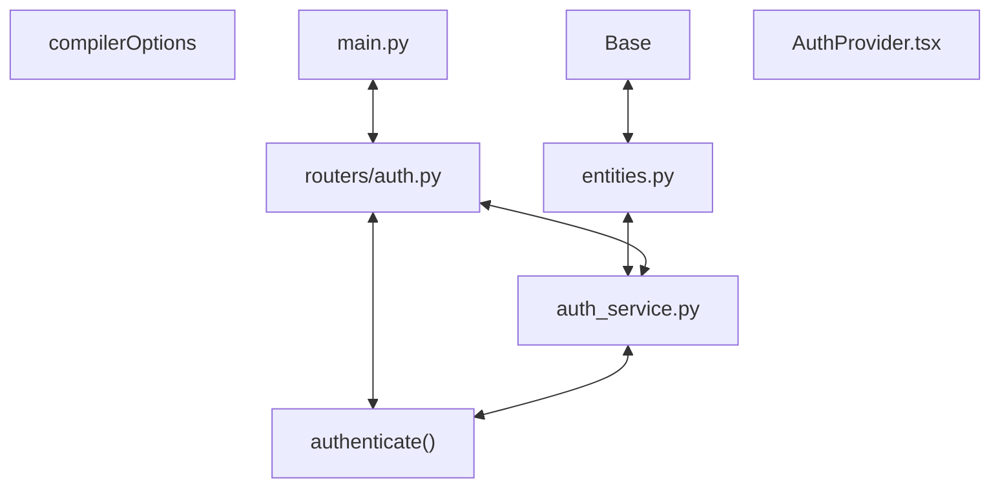

# Codebase Architectural Report

> **Auto-generated** by graphify knowledge graph analysis  
> **Purpose**: Dependency map, connection analysis, subsystem breakdown, and quality hotspots.

---

## 1. Executive Summary

- **Total Components**: `153`
- **Total Connections**: `253`
- **Subsystem Modules**: `1`
- **Dependency Types**: `10`

**Key Architectural Hubs:**

| # | Component | File | Type | Connections |
|---|-----------|------|------|-------------|
| 1 | `compilerOptions` | `frontend/tsconfig.json` | function | 18 |
| 2 | `routers/auth.py` | `backend/app/routers/auth.py` | file | 12 |
| 3 | `auth_service.py` | `backend/app/services/auth_service.py` | file | 12 |
| 4 | `entities.py` | `backend/app/models/entities.py` | file | 11 |
| 5 | `authenticate()` | `backend/app/services/auth_service.py` | method | 11 |
| 6 | `Base` | `backend/app/core/database.py` | class | 10 |
| 7 | `main.py` | `backend/app/main.py` | file | 10 |
| 8 | `AuthProvider.tsx` | `frontend/src/auth/AuthProvider.tsx` | class | 10 |

---

## 2. Dependency & Connection Analysis

### Relationship Types

| Relationship | Count | Share |
|-------------|-------|-------|
| `contains` | 83 | 33% |
| `rationale_for` | 45 | 18% |
| `imports` | 44 | 17% |
| `imports_from` | 28 | 11% |
| `references` | 20 | 8% |
| `calls` | 13 | 5% |
| `uses` | 9 | 4% |
| `inherits` | 6 | 2% |
| `extends` | 4 | 2% |
| `method` | 1 | 0% |

### Hub Dependency Diagram

### Most Connected Pairs

| Component A | Component B | Shared Connections |
|-------------|-------------|-------------------|
| `LoginResponse` | `authenticate()` | 2 |
| `Package the Meridian API application.` | `app/__init__.py` | 1 |
| `Expose API configuration and persistence infrastructure.` | `core/__init__.py` | 1 |
| `Settings` | `config.py` | 1 |
| `Load application settings from environment variables.` | `config.py` | 1 |
| `config.py` | `database.py` | 1 |
| `config.py` | `security.py` | 1 |
| `config.py` | `main.py` | 1 |
| `Provide typed runtime configuration for the API.` | `Settings` | 1 |
| `.cors_origin_list()` | `Settings` | 1 |

---

## 3. Subsystem & Module Breakdown

### 3.1 backend/app
**Nodes**: `153`  
**Files**: `.engine/memory/progress_summary.md`, `backend/app/__init__.py`, `backend/app/core/__init__.py`, `backend/app/core/config.py`, `backend/app/core/database.py`, `backend/app/core/security.py` +25 more

| Component | Type | File | Connections |
|-----------|------|------|-------------|
| `compilerOptions` | function | `frontend/tsconfig.json` | 18 |
| `routers/auth.py` | file | `backend/app/routers/auth.py` | 12 |
| `auth_service.py` | file | `backend/app/services/auth_service.py` | 12 |
| `entities.py` | file | `backend/app/models/entities.py` | 11 |
| `authenticate()` | method | `backend/app/services/auth_service.py` | 11 |
| `Base` | class | `backend/app/core/database.py` | 10 |
| `main.py` | file | `backend/app/main.py` | 10 |
| `AuthProvider.tsx` | class | `frontend/src/auth/AuthProvider.tsx` | 10 |
| `LoginPage.tsx` | class | `frontend/src/pages/LoginPage.tsx` | 10 |
| `database.py` | file | `backend/app/core/database.py` | 9 |

**External dependencies:** `Package the Meridian API application.` (1), `Expose API configuration and persistence infrastructure.` (1), `Load application settings from environment variables.` (1), `Provide typed runtime configuration for the API.` (1), `Split configured browser origins into an allow list. Returns: Explicit…` (1)

---

## 4. API Reference

Public classes and functions by subsystem.

### backend/app

| Name | Type | File | Connections |
|------|------|------|-------------|
| `compilerOptions` | function | `frontend/tsconfig.json` | 18 |
| `Base` | class | `backend/app/core/database.py` | 10 |
| `AuthProvider.tsx` | class | `frontend/src/auth/AuthProvider.tsx` | 10 |
| `LoginPage.tsx` | class | `frontend/src/pages/LoginPage.tsx` | 10 |
| `devDependencies` | function | `frontend/package.json` | 9 |
| `Coordinator` | class | `backend/app/models/entities.py` | 8 |
| `InvalidCredentialsError` | class | `backend/app/services/auth_service.py` | 8 |
| `LoginResponse` | class | `backend/app/schemas/auth.py` | 7 |

---

## 5. Code Quality & Architectural Risk Hotspots

### Component Type Distribution

| Type | Count | Share |
|------|-------|-------|
| function | 70 | 46% |
| class | 43 | 28% |
| file | 21 | 14% |
| method | 19 | 12% |

### High-Connectivity Hotspots

**1** component(s) with >15 connections:

| Component | File | Connections |
|-----------|------|-------------|
| `compilerOptions` | `frontend/tsconfig.json` | 18 |

### Dependency Cycles

**72** circular dependency loop(s) detected:

| # | Cycle Path |
|---|-----------|
| 1 | `frontend_src_api_client → frontend_src_types → frontend_src_types_loginresponse` |
| 2 | `frontend_src_auth_authprovider → frontend_src_types_user → frontend_src_types` |
| 3 | `frontend_src_auth_authprovider → frontend_src_auth_authprovider_authcontextvalue → frontend_src_types_user` |
| 4 | `frontend_src_auth_authprovider_authprovider → frontend_src_pages_loginpage_test → frontend_src_auth_authprovider` |
| 5 | `frontend_src_pages_loginpage → frontend_src_pages_loginpage_test → frontend_src_auth_authprovider` |
| 6 | `frontend_src_app → frontend_src_pages_loginpage_loginpage → frontend_src_pages_loginpage_test → frontend_src_auth_authprovider` |
| 7 | `frontend_src_pages_loginpage → frontend_src_pages_loginpage_loginpage → frontend_src_pages_loginpage_test` |
| 8 | `frontend_src_auth_authprovider_useauth → frontend_src_pages_loginpage_loginpage → frontend_src_pages_loginpage_test → frontend_src_auth_authprovider` |
| 9 | `frontend_src_app → frontend_src_pages_loginpage → frontend_src_auth_authprovider` |
| 10 | `frontend_src_api_client → frontend_src_pages_loginpage → frontend_src_auth_authprovider → frontend_src_types` |

### Orphaned Components

**6** isolated node(s) with no connections:

| Component | File |
|-----------|------|
| `access.spec.ts` | `frontend/e2e/access.spec.ts` |
| `vite.config.ts` | `frontend/vite.config.ts` |
| `vitest.config.ts` | `frontend/vitest.config.ts` |
| `dashboard-member-panel` | `todos.yaml` |
| `member-care-workflows` | `todos.yaml` |
| `delivery-quality` | `todos.yaml` |

---

## 6. How to Navigate

1. **Interactive D3 Map** — open `graph.html` to explore node connections visually.
2. **Knowledge Graph Queries** — use MCP tools (`graph_query`, `graph_explain_node`, `graph_impact_radius`).
